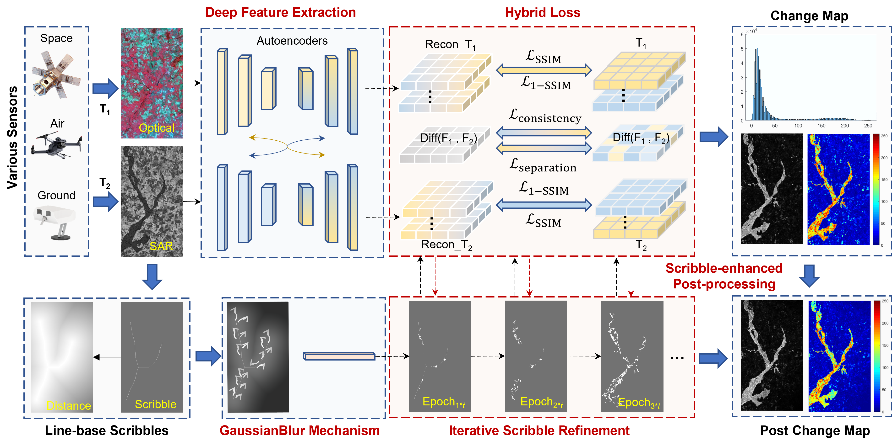

<h1 align="center">SHIFT: Scribble-driven Hybrid Iterative Feature Tracker for Multimodal Remote Sensing Change Detection</h1>

<p align="center">
This is the official PyTorch implementation of <b>SHIFT</b>, a weakly-supervised multimodal change detection framework guided by sparse scribble annotations.  
<b>Note:</b> This work is currently under review.
</p>

---

## 1. Introduction

> Multimodal remote sensing change detection (MRS-CD) plays a vital role in applications such as environmental monitoring, disaster assessment, and urban development. However, challenges like spectral heterogeneity, spatial misalignment, and annotation costs make accurate MRS-CD extremely difficult.

**SHIFT** introduces a weakly-supervised MRS-CD framework that utilizes sparse **scribble annotations** instead of dense labels. It overcomes previous methods' limitations in fine-grained change detection and multimodal generalization.

**Key features include:**
- **Scribble-guided multimodal change detection**: Fully integrates scribble supervision into both training and refinement stages.
- **Learnable Gaussian attention module**: Adaptively transforms scribble inputs into attention maps to focus on potential change regions.
- **Consistency and separation constraints**: Promotes intra-class feature similarity and inter-class distinctness for enhanced localization.

Extensive experiments on 13 diverse multimodal datasets demonstrate that SHIFT achieves high accuracy with minimal annotation cost and strong generalization across modalities.

---

## 2. Pipeline

The overall workflow of SHIFT is illustrated below:

<p align="center">
  
</p>

---

## 3. Installation

Follow these steps to set up the environment:

1. Clone the repository:

    ```bash
    git clone https://github.com/MissYongjie/SHIFT.git
    cd SHIFT
    ```

2. Install the required dependencies:

    ```bash
    pip install -r requirements.txt
    ```

3. Ensure the following main packages are installed:

    ```
    Python 3.10.2
    numpy
    scipy
    scikit-image
    scikit-learn
    torch >= 2.2.0
    torchvision
    pytorch-msssim
    imageio
    matplotlib
    tensorboard
    opencv-python
    tqdm
    ```

---

## 4. Usage

### 4.1 Data Preparation

Prepare the following `.mat` files:

- `image_t1`
- `image_t2`
- `Ref_gt`

**Note:**  
Scribble annotations should be prepared separately or generated using the provided tools.

### 4.2 Training

1. Modify training parameters if needed in `configs/config.py` (e.g., learning rate, number of epochs, update intervals).
2. Run the training pipeline:

    ```bash
    python main.py
    ```

### 4.3 Results

- Predicted change maps, distance maps, and updated scribble visualizations are saved under `./results/`.
- Tensorboard logs are saved under `./logs/` for monitoring training progress.


---

## 5. Citation

This work is currently under review.  
If you find this project helpful, please consider citing it in the future:


```
SHIFT: Scribble-driven Hybrid Iterative Feature Tracker for Multimodal Remote Sensing Change Detection
Under review, 2025.
Available at: https://github.com/MissYongjie/SHIFT
```

